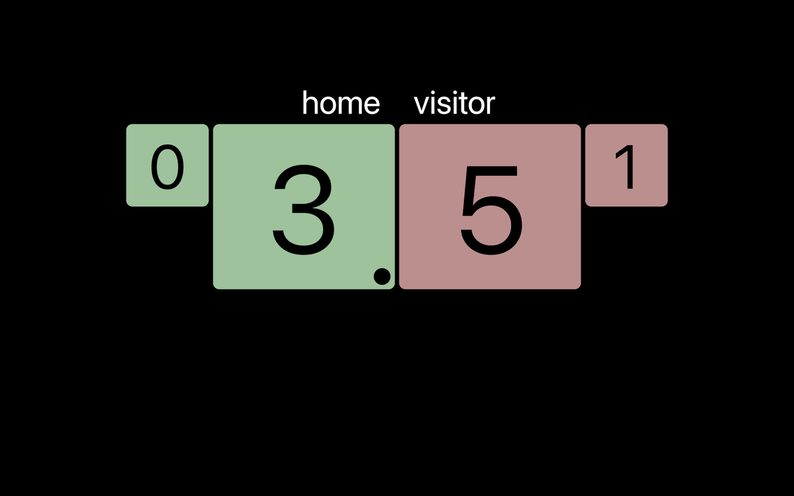

# Ping Pong Scoreboard
This ping pong scoreboard has implemented using Python, PyQT5 and Paho-MQTT.
This scoreboard supprots a keyboard to receive key events.




## Preparation
```
pip3 install PyQT5
pip3 install paho-mqtt 
```

## How to launch
```
python3 game_board.py
```

## How to use after launching the ping pong scoreboard
Please translate Korean to your language.

- Key 1: HOME 팀 점수 +1
- Key 2: HOME 팀 점수 -1

- Key 3: VISITOR 팀 점수 +1
- Key 4: VISITOR 팀 점수 -1

- Key 5: 점수 좌/주 전환

- Key 9: 서브 전환

- Key 0: 점수 리셋

## How to receive a key event data from other devices using MQTT topic
Also it can receive a key event to uses a MQTT topic from various I/F such as IR, Bluetooth, Open API and more devices if you want.

### Install MQTT broker
To use MQTT topic, a system should install the MQTT broker.

For Ubuntu 18.04
```
sudo apt install mosquitto
sudo service mosquitto start
```

### About MQTT Topic: event/key
This scoreboard starts subscribing 'event/key' topic when the scoreboard connects to the MQTT broker.

And this scoreboard uses a json format to receive data in 'event/key' topic.
The format is very simple:
```
{
    "key": "1"
}
```

### For example:
To send '1' key event:
```
mosquitto_pub -t event/key -m "{\"key\": \"1\"}"
```

To send '0' key event:
```
mosquitto_pub -t event/key -m "{\"key\": \"0\"}"
```
